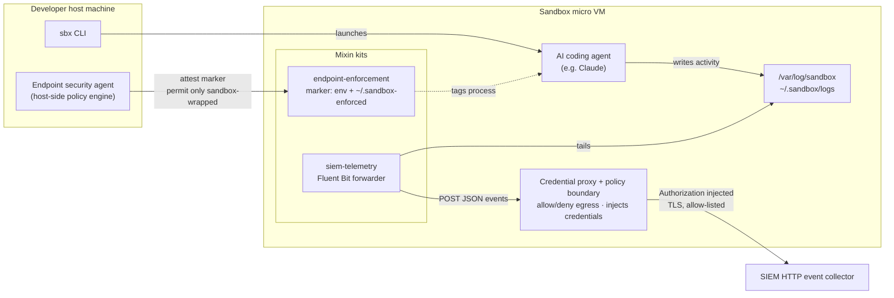

# sbx-kits

Docker Sandboxes kits that integrate sandboxed AI coding agents with a security
platform along two axes:

- **Where an agent may run** — enforced at the host endpoint.
- **What an agent did** — reported to a SIEM.

Docker controls the runtime blast radius (each agent runs in an isolated micro
VM with a credential-proxying, policy-enforcing boundary); these kits give an
external security platform the signals it needs to enforce and observe that
boundary from the outside.

## Architecture



- **`endpoint-enforcement`** tags the agent process with a marker; the host
  endpoint policy attests it and permits only sandbox-wrapped agents.
- **`siem-telemetry`** tails sandbox activity logs and forwards them through the
  credential proxy — which injects the collector token and enforces the egress
  allow-list — to the SIEM.

## Kits

| Kit | Kind | Purpose |
|---|---|---|
| [`endpoint-enforcement`](./endpoint-enforcement/) | mixin | Marks sandbox-wrapped agent processes so a host-side endpoint policy can permit them and deny agents spawned outside a sandbox. |
| [`siem-telemetry`](./siem-telemetry/) | mixin | Forwards sandbox observability (process, network, file, agent activity) to a SIEM HTTP event collector via Fluent Bit, with a proxy-injected collector credential. |

Both are `kind: mixin`, `schemaVersion: "2"`, and layer onto any base agent
(e.g. `claude`).

## Quick start

Run a base agent with one kit:

```bash
sbx run claude --kit ./endpoint-enforcement/ .
```

Stack both — enforcement governs *where* the agent runs, telemetry reports
*what* it did:

```bash
sbx run claude \
  --kit ./endpoint-enforcement/ \
  --kit ./siem-telemetry/ \
  --kit-arg siem-telemetry.siemCollectorHost=collector.example.internal .
```

See each kit's `README.md` for its arguments, credential bindings, and the
published-OCI / git-reference / local-path invocation forms.

## Layout

```
.
├── endpoint-enforcement/
│   ├── spec.yaml
│   └── README.md
└── siem-telemetry/
    ├── spec.yaml
    ├── files/
    │   └── home/.config/fluent-bit/sandbox-telemetry.conf
    └── README.md
```

## Validate

```bash
sbx kit validate ./endpoint-enforcement/
sbx kit validate ./siem-telemetry/ --kit-arg siemCollectorHost=collector.example.internal
```
