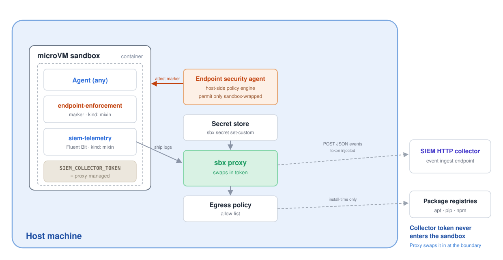

# sbx-kits

> **Extend your endpoint-security and SIEM stack into the sandbox boundary.**
> Security kits for [Docker Sandboxes](https://docs.docker.com/ai/sandboxes/) that
> govern *where* sandboxed AI coding agents may run and stream *what* they did to
> your SIEM — defense in depth for the microVM, enforced and observed from the host.



Docker Sandboxes kits that integrate sandboxed AI coding agents with a security
platform along two axes:

- **Where an agent may run**: enforced at the host endpoint.
- **What an agent did**: reported to a SIEM.

Docker controls the runtime blast radius (each agent runs in an isolated micro
VM with a credential-proxying, policy-enforcing boundary); these kits give an
external security platform the signals it needs to enforce and observe that
boundary from the outside: defense in depth without either side losing control.

## Architecture

The kits compose the sandbox's isolation + egress control with two external
security functions (diagram above):

1. **Install time**: `siem-telemetry` installs Fluent Bit (the prebuilt
   package on 4 KB-page hosts (amd64), a jemalloc-free source build on
   16 KB-page hosts (arm64 microVMs)), so it works on both architectures; both
   kits are `kind: mixin`, so they layer onto whatever base agent you run.
2. **In the container**: `endpoint-enforcement` marks the agent process
   (`SANDBOX_ENFORCED=1` + a read-only `~/.sandbox-enforced` attestation file),
   and the collector credential reads as the literal `proxy-managed` sentinel;
   the real token is never present.
3. **At the host endpoint**: the endpoint security agent attests the marker and
   **permits only sandbox-wrapped agents**; any agent process that spawns
   outside a sandbox is denied.
4. **At the sbx proxy**: `siem-telemetry` ships activity logs outbound; the proxy
   checks the collector host against the egress allow-list and swaps the
   `proxy-managed` sentinel for the real token in the `Authorization` header, so
   the SIEM sees authenticated JSON events while the container never held the key.

## Kits

| Kit | Kind | Purpose |
|---|---|---|
| [`endpoint-enforcement`](./endpoint-enforcement/) | mixin | Marks sandbox-wrapped agent processes so a host-side endpoint policy can permit them and deny agents spawned outside a sandbox. |
| [`siem-telemetry`](./siem-telemetry/) | mixin | Forwards sandbox observability (process, network, file, agent activity) to a SIEM HTTP event collector via Fluent Bit, with a proxy-injected collector credential. |

Both are `kind: mixin`, `schemaVersion: "2"`, and layer onto any base agent
(e.g. `claude`).

The kits are written against vendor-generic terms; see
[`docs/palo-alto-networks.md`](./docs/palo-alto-networks.md) for how they map to
concrete **Cortex XSIAM** (SIEM) and **Cortex XDR** (endpoint) products, and what
is configured in-kit vs. on the Palo Alto Networks side.

## Quick start

Run a base agent with one kit:

```bash
sbx run claude --kit ./endpoint-enforcement/ .
```

Stack both: enforcement governs *where* the agent runs, telemetry reports
*what* it did:

```bash
sbx run claude \
  --kit ./endpoint-enforcement/ \
  --kit ./siem-telemetry/ \
  --kit-arg siem-telemetry.siemCollectorHost=collector.example.internal .
```

See each kit's `README.md` for its arguments, credential bindings, and the
published-OCI / git-reference / local-path invocation forms.

## Layout

```
.
├── endpoint-enforcement/
│   ├── spec.yaml
│   └── README.md
└── siem-telemetry/
    ├── spec.yaml
    ├── files/
    │   └── home/.config/fluent-bit/sandbox-telemetry.conf
    └── README.md
```

## Validate

```bash
sbx kit validate ./endpoint-enforcement/
sbx kit validate ./siem-telemetry/ --kit-arg siemCollectorHost=collector.example.internal
```
